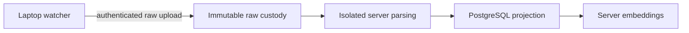

Hosted raw sync keeps original agent session files from one or more machines in
hosted custody. Each laptop captures supported local sources, authenticates as a
provisioned device, resumes interrupted uploads, and remembers durable progress
across restarts. `agentsview raw-sync watch` keeps the hosted copy current.



The server parses accepted generations directly into PostgreSQL and can build
hosted semantic-search generations from that projection. Enable
`raw_derivation` on an explicitly provisioned hosted tenant to make uploaded
sessions browsable. Hosted processing uses no SQLite archive intermediary;
SQLite databases captured from providers remain valid source artifacts.

Device enrollment and revocation remain operator-managed. The operator supplies
each laptop with a server URL, device ID and credential. There is no public
enrollment command or HTTP endpoint. The broader delivery work remains tracked
in [issue #1352](https://github.com/kenn-io/agentsview/issues/1352), including
retention, garbage collection and disaster rebuilds.

## Provision a hosted instance

Use one PostgreSQL schema, restricted runtime role and server instance per
tenant. Requests cannot select arbitrary tenants. The schema is permanently
bound to its tenant; runtime connections check the binding, forced row-level
security, constraints, indexes and protected catalog before serving or leasing
work. Provisioning and upgrades require a separate schema-owner connection.

Configure an owner target and a runtime target in the operator's protected
configuration. Supply actual connection URLs and a generated cursor secret
through your secret manager or protected config file. The values below are
placeholders, not environment-variable interpolation. Use the same tenant and
schema for both targets, and make the runtime target the effective default:

```toml
default_pg = "hosted"
require_auth = true
cursor_secret = "REPLACE_WITH_BASE64_RANDOM_SECRET"

[pg.provision]
url = "postgres://hosted_owner@db.example.com/agentsview?sslmode=require"
schema = "hosted_sessions"
raw_tenant = "tenant-example"

[pg.hosted]
url = "postgres://hosted_runtime@db.example.com/agentsview?sslmode=require"
schema = "hosted_sessions"
raw_tenant = "tenant-example"
raw_derivation = true
raw_poll_seconds = 5
raw_attempt_seconds = 60
raw_max_attempts = 5
hosted_embeddings_enabled = true
hosted_embeddings_poll_seconds = 5
hosted_embeddings_attempt_seconds = 120
hosted_embeddings_max_attempts = 5
hosted_embeddings_concurrency = 1
```

`cursor_secret` is a stable base64-encoded secret shared by restarts of this
instance. Keep authentication enabled even on loopback. Supply TLS through your
reverse proxy and configure the exact public origin as for ordinary remote
access. The shared server bearer token protects viewer APIs; device credentials
and scoped tokens separately protect raw-sync routes.

Run explicit provisioning with the owner target:

```bash
agentsview pg hosted-provision provision
```

This command installs or upgrades hosted tables and protections. It does not
create login roles or grant runtime access. Existing derived rows are retained;
existing raw rows must already belong to the chosen tenant. Unknown relations,
unmanaged vector layouts and conflicting ownership can block adoption. Plan
imports and schema upgrades during an operator-controlled maintenance window.
Runtime startup never migrates or provisions the hosted schema.

Create a separate login role with `NOSUPERUSER NOBYPASSRLS NOCREATEDB
NOCREATEROLE NOREPLICATION NOINHERIT`, provision its credential through your
normal PostgreSQL administration process, and grant it `CONNECT` to the
database. It must own no application objects, have no role memberships, database
or schema `CREATE`, sibling-schema data access, or callable application
`SECURITY DEFINER` functions. Remove inherited `PUBLIC` grants where necessary,
including `CREATE` on the public schema on older PostgreSQL installations. Do
not grant `TRUNCATE`, `TRIGGER` or `REFERENCES` on hosted tables.

For a newly provisioned schema, the following grants cover full and transcript
content, custody, publication, bounded reparse and supported curation. Replace
`hosted_sessions` and `hosted_runtime` with your schema and restricted role. Run
this as the owner before starting the runtime:

```sql
GRANT USAGE ON SCHEMA hosted_sessions TO hosted_runtime;
GRANT SELECT ON ALL TABLES IN SCHEMA hosted_sessions TO hosted_runtime;

GRANT INSERT ON hosted_sessions.raw_device_tokens,
  hosted_sessions.raw_manifest_entries, hosted_sessions.raw_manifest_objects,
  hosted_sessions.messages, hosted_sessions.tool_calls,
  hosted_sessions.tool_result_events, hosted_sessions.usage_events,
  hosted_sessions.secret_findings, hosted_sessions.excluded_sessions,
  hosted_sessions.raw_projection_generations,
  hosted_sessions.raw_source_contributions,
  hosted_sessions.raw_session_public_aliases,
  hosted_sessions.raw_embedding_outbox TO hosted_runtime;

GRANT INSERT, UPDATE ON hosted_sessions.raw_objects,
  hosted_sessions.raw_source_heads, hosted_sessions.raw_ingest_jobs,
  hosted_sessions.raw_source_projections, hosted_sessions.raw_session_groups,
  hosted_sessions.raw_content_revisions, hosted_sessions.raw_session_branches,
  hosted_sessions.raw_corpus_state, hosted_sessions.raw_projection_rollouts
  TO hosted_runtime;
GRANT INSERT ON hosted_sessions.raw_manifests TO hosted_runtime;

GRANT INSERT, UPDATE, DELETE ON hosted_sessions.raw_upload_sessions,
  hosted_sessions.sessions, hosted_sessions.session_sources,
  hosted_sessions.pinned_messages, hosted_sessions.raw_curation,
  hosted_sessions.raw_pins TO hosted_runtime;
GRANT INSERT, DELETE ON hosted_sessions.starred_sessions,
  hosted_sessions.raw_session_links TO hosted_runtime;

GRANT USAGE ON SEQUENCE hosted_sessions.raw_ingest_jobs_id_seq,
  hosted_sessions.tool_calls_id_seq, hosted_sessions.tool_result_events_id_seq,
  hosted_sessions.usage_events_id_seq, hosted_sessions.pinned_messages_id_seq
  TO hosted_runtime;
```

Sequence names above are those created by provisioning. For an adopted schema,
resolve the actual owned sequence with `pg_get_serial_sequence`; serial IDs need
`USAGE` or `UPDATE`, while identity-generated IDs need no separate sequence
grant. Enrollment needs an operator credential with device-write privileges; the
runtime grants intentionally omit those privileges.

`archive_content = "usage"` also requires `SELECT` on `vector_generations` and
`SELECT, DELETE` on existing `vector_documents`, `vector_push_state` and each
existing `vector_chunks_g<ID>` table named by a generation. This removes any
previously retained indexed content. It does not create or consume embeddings.
The runtime checks the configured policy's grants before readiness and reports
missing privileges instead of silently disabling hosted processing.

Start the effective default target:

```bash
agentsview pg serve --no-browser
```

Named targets retain their ordinary selection rules. A single-target deployment
can put the same hosted keys under `[pg]`. `AGENTSVIEW_PG_URL` and
`AGENTSVIEW_PG_SCHEMA` override only the effective default target. They do not
rewrite the separate named owner target. `pg push` refuses a hosted-owned schema
before mutation, even if the client omits its hosted configuration fields. Use a
separate legacy schema for local pushes.

## Hosted semantic search

Hosted embeddings use global, named profiles. The semantic recipe determines
the generation fingerprint: model, dimensions, chunking inputs, prefixes,
suffix, dimension-request behavior and automated-session scope, together with
the builder, chunker, encoding and corpus versions. Keep an old profile
configured while its generation is active. Changing its semantic recipe makes
that generation unavailable; add a new profile name for a model migration.

Endpoints, credentials, selected server and transport tuning are replaceable.
Changing those settings does not change the recipe fingerprint or require a
rebuild, provided the replacement server implements the same semantic recipe.

This two-profile configuration is ready for an initial build followed by a
model migration:

```toml
[hosted_embeddings.profiles.current]
include_automated = false

[hosted_embeddings.profiles.current.embeddings]
model = "embedding-model-a"
dimension = 768
max_input_chars = 8192
default_server = "primary"
query_prefix = "query: "
document_prefix = "passage: "
input_suffix = ""
request_dimensions = false

[hosted_embeddings.profiles.current.embeddings.servers.primary]
endpoint = "https://embeddings.example.com/v1"
api_key_env = "HOSTED_EMBEDDING_KEY_A"
batch_size = 32
concurrency = 1
timeout = "30s"
max_retries = 3

[hosted_embeddings.profiles.next]
include_automated = false

[hosted_embeddings.profiles.next.embeddings]
model = "embedding-model-b"
dimension = 1024
max_input_chars = 8192
default_server = "primary"

[hosted_embeddings.profiles.next.embeddings.servers.primary]
endpoint = "https://embeddings.example.com/v1"
api_key_env = "HOSTED_EMBEDDING_KEY_B"
batch_size = 32
concurrency = 1
timeout = "30s"
max_retries = 3
```

The selected API key environment variable is read only when the runtime creates
that profile's encoder. Provisioning and status do not need provider
credentials and never send an embedding request. A missing or empty selected
key fails that work explicitly; AgentsView does not fall back to another
profile or credential. Unused profile credentials and unused owner target URLs
may remain unavailable to the runtime.

Before provisioning embeddings, have the database administrator install
pgvector in `public` or the bound tenant schema and grant the restricted role
`USAGE` on that extension schema. Other extension layouts are unsupported. For
the common `public` placement, run this as the owner after pgvector is installed:

```sql
GRANT USAGE ON SCHEMA public TO hosted_runtime;
```

Then provision and select the initial generation with the owner target. The
runtime role must already exist and remain restricted as described above.

```bash
agentsview pg embeddings provision provision --profile current --runtime-role hosted_runtime --instance-key initial-current
agentsview pg embeddings status hosted
agentsview pg embeddings status hosted --json
```

The provision command creates and grants only the embedding objects, records
the generation as desired, and returns immediately. It does not create roles,
activate incomplete coverage or wait for the worker. Start `pg serve` with
`hosted_embeddings_enabled = true`; encoding begins only after server readiness.
`status` reports active and desired identity, backfill state, and separate
ready, leased, retry, failed and complete counters without source IDs. It also
reports each generation's `activation_mode`. Omitting `--activation-mode`
preserves an existing generation's policy and gives a new generation the
`automatic` policy.

To build a migration in shadow, keep `current` and its credential configured,
add `next`, and select a fresh manual instance:

```bash
agentsview pg embeddings rebuild provision --profile next --runtime-role hosted_runtime --instance-key migration-next --activation-mode manual
agentsview pg embeddings status hosted --json
```

The active generation continues serving while the desired generation builds.
The worker keeps a manual generation in shadow after it reaches
`activation_ready`. This status proves current source coverage and clean
worker state; it does not measure semantic parity. Compare the generations by
the operator's separate acceptance process, then activate the exact desired
generation through the restricted runtime target:

```bash
agentsview pg embeddings activate hosted --generation 2
agentsview pg embeddings activate hosted --generation 2 --format json
```

Activation rechecks desired selection, complete coverage, pending source work,
and the configured `next` profile and credential. It does not contact the
encoder or rebuild vectors. A refusal leaves the active generation unchanged.
Repeating a successful activation is safe. Keep both profiles and credentials
available throughout the shadow build, and retain the old profile and
credential for rollback.

Repeating the same incomplete instance key and recipe preserves its progress,
leases, and activation policy. A completed rebuild requires a new instance
key. Changing `--activation-mode` for an existing instance is rejected.

The first owner provision or rebuild after this upgrade installs the activation
policy and database guard without replacing existing generation data. Run that
owner command before starting the new runtime against an older embedding
schema: the new runtime rejects the old catalog until the explicit owner
upgrade completes. An older binary also rejects the upgraded catalog on a new
startup. An older worker that was already running cannot select a manual
generation because the database guard rejects its automatic update.

Rollback is a rebuild workflow rather than an instant pointer swap. Reselect
the retired profile with its existing instance key using the owner command;
the worker rebuilds coverage missed while it was retired, and the same
readiness and activation rules apply before it can serve again.

Failed and exhausted requirements are durable. Raising
`hosted_embeddings_max_attempts`, restarting, or selecting the same instance
again does not reset them. Repair the provider, credential, resource limit, or
profile problem first, then inspect the failed count and explicitly queue a
bounded retry:

```bash
agentsview pg embeddings status hosted --json
agentsview pg embeddings retry-failed hosted --generation 1 --batch-size 64
```

The generation ID is required. Each call examines 1–256 failed requirements
(64 by default) and reports only the generation ID plus examined, retried, and
skipped counts. Skipped failures are stale or no longer eligible; they stay
unchanged until the normal worker reconciliation handles their source state.
Run the command again to process another bounded batch. An immediate repeat
before worker activity reports zero counts for requirements already queued.

Retrying resets the normal attempt cap for the selected requirements. Repeated
manual retries can therefore consume more encoding budget. The command does not
start the worker, resolve encoder credentials, send encoder requests, open the
local SQLite archive, rebuild successful vectors, or change the active
generation. With `hosted_embeddings_enabled = false`, recovered requirements
remain queued until a separately running enabled worker claims them.

Fresh provisioning includes the failed-recovery index. After upgrading an
older hosted embedding schema, use `status` to identify the current desired
instance and reprovision that same profile and instance key with the owner
target before using retry. If status has no desired generation, reprovision the
active instance instead. Provisioning always reselects the supplied instance as
desired, so reprovisioning the active instance while a different desired
generation is building would interrupt that build's selection. The owner
upgrade installs the index and can wait for an index build lock; the restricted
runtime command never creates or repairs database objects.

Set `hosted_embeddings_enabled = false` and restart to stop encoding while
keeping a valid active generation available to HTTP, direct CLI and MCP
searches. Retention, garbage collection, raw parse recovery, and disaster
rebuilds remain future operator workflows.

With `archive_content = "usage"`, writable hosted startup clears documents,
chunks and reusable vector values from every generation before any worker could
start. Generation identities remain, but semantic search stays unavailable
until content retention is restored and a fresh generation completes. This
explicit policy transition has a startup cost proportional to retained
generation content.

## Isolation and processing limits

Hosted parser activation requires Linux amd64 or arm64, a cgo-enabled build,
user/mount/network namespaces, `close_range`, and seccomp with thread
synchronization. Startup tests actual source visibility inside the sandbox
before claiming a job. Unsupported kernels, containers, non-Linux hosts and
Linux builds without cgo fail closed. There is no in-process parser fallback.
The positive kernel suite has been executed on amd64; arm64 has compile proof
but still needs an execution gate on that architecture.

Each parser child gets only bounded protocol pipes and a minimal environment. A
pre-runtime constructor closes inherited descriptors above stderr before Go
initializes. The child sees a read-only source mount inside an otherwise empty,
read-only jail. Filesystem escape, networking and process creation are denied;
seccomp applies to every existing thread and allows only constrained runtime
thread creation. No external sandbox helper is required.

| Limit                                        | Value                                           |
| -------------------------------------------- | ----------------------------------------------- |
| Worker concurrency                           | One sequential job per instance                 |
| Poll interval                                | Default 5 seconds; maximum 60                   |
| Whole attempt wall time                      | Default 60 seconds; maximum 300                 |
| Attempts per selected generation             | Default 5; maximum 10                           |
| Retry backoff                                | Exponential from 1 second, capped at 60 seconds |
| Lease / heartbeat                            | 60 seconds / 10 seconds                         |
| Materialized source bytes                    | 512 MiB                                         |
| Parser stdout / stderr                       | 32 MiB / 64 KiB                                 |
| Child address space / data                   | 2 GiB / 512 MiB                                 |
| Child CPU / open descriptors                 | 30 seconds / 64                                 |
| Manifest bytes / entries / object references | 1 MiB / 4,096 / 16,384                          |

Custody may accept files larger than the materialization limit. Such captures
remain retained but cannot be projected by this worker. Accepted source bytes
are untrusted, even after device authentication. Publication atomically writes
normalized rows, source proof, identity changes, curation and job outcome under
the selected generation and lease fence. Partial results retain older proof for
unresolved members and retry finitely. Exhausted jobs remain failed until new
source or processing-version selection provides new work.

Equivalent content from several devices coalesces when it shares a stable
provider session identity. Without that identity, sources remain separate even
when their content matches. Divergent content makes the
bare session ID ambiguous and exposes explicit variants. Source removal retracts
only that source's proof. Names, stars and pins survive compatible publication;
ambiguous identity never silently picks a transcript. Owner imports that change
legacy identity must retry their transaction on serialization failure (`SQLSTATE
40001`) if publication or curation holds a conflicting identity lock. Ordinary
legacy content and curation writes do not take those identity locks.

The maintenance pass examines at most 64 indexed pending signal rows with a
10-second timeout. It does not scan the archive during idle polling. Shutdown
cancels and joins worker, materializer and parser work before closing custody
and PostgreSQL.

## Reparse and rollback

After an executable upgrade changes the parser data version, schedule current
heads explicitly in bounded batches:

```bash
agentsview pg raw-reparse hosted --run-id parser-rollout-1 --batch-size 64
```

Repeat the same run ID until the command output contains `complete=true`. A call
selects at most 1–256 heads and atomically saves its keyset checkpoint. The run
ID is bound to the executable's processing version. Equal manifest/version
selection is idempotent: a new run ID does not resurrect completed or exhausted
jobs for that same selection. Startup and idle polls perform no reparse scan.

To stop derivation, set `raw_derivation = false` and restart. Keep `raw_tenant`,
authentication, the cursor secret and the tenant-bound runtime connection.
Hosted public reads and raw custody remain available; accepted new manifests
still select their current processing version. Removing `raw_tenant` from an
owned schema fails rather than exposing physical storage identities. This
rollback does not convert the schema back to a `pg push` destination.

Keep PostgreSQL metadata and the immutable raw repository together in backups.
Automated retention, garbage collection, disaster rebuilds, enrollment UX and
automatic migration cutover tooling remain outside this release.

## Laptop raw watch daemon

`agentsview raw-sync watch` watches supported local provider roots, captures
their original files, and uploads durable generations. It does not parse
sessions or write the normal local SQLite archive. S3 roots are excluded.

The server URL and device ID may be flags or environment variables. The device
credential is environment-only so it does not appear in process arguments:

```bash
export AGENTSVIEW_RAW_SYNC_URL=https://agents.example.com
export AGENTSVIEW_RAW_SYNC_DEVICE_ID=device-id
export AGENTSVIEW_RAW_SYNC_CREDENTIAL=device-credential
agentsview raw-sync watch
```

The command performs an initial bounded audit, watches for changes, repeats the
audit every 15 minutes by default, and retries uploads every minute. Captures
and upload state are kept under `raw-sync/` in the configured AgentsView data
directory. `agentsview raw-sync status` prints path-free JSON describing the
local checkpoint, pending work, retry time, failures, and coverage.

The normal writable `agentsview serve` daemon has its own parser watcher. Run
both only when local parsed sessions and hosted raw custody are both required;
doing so intentionally creates two watchers over the same provider roots.

## HTTP control plane

In legacy mode, `agentsview pg serve` registers raw-sync routes when its
PostgreSQL role has the required custody-table and ingest-job sequence grants. A
read-only role keeps serving the PostgreSQL UI and API without these routes.
Explicit hosted mode uses `raw_tenant` and requires the full hosted preflight;
`raw_derivation` controls its worker. When legacy route requirements are
missing, startup logs `raw-sync routes disabled; missing requirements:` followed
by the exact missing table privileges, sequence access, or read-only transaction
setting.

Upgrading a least-privilege raw-sync role now requires `SELECT` and `UPDATE` on
`raw_ingest_jobs`, in addition to its existing `INSERT` and sequence `USAGE`.
Manifest commits retire the previous source head's pending parse job. As the
schema owner, grant the additional privileges and restart `pg serve`:

```sql
GRANT SELECT, UPDATE ON agentsview.raw_ingest_jobs TO raw_sync_runtime;
```

Replace `agentsview` and `raw_sync_runtime` with your schema and runtime role.
Until these grants are applied, the normal session UI continues to work, but
raw-sync HTTP routes are omitted.

The implemented routes are:

| Route                                   | Authentication                          | Operation                               |
| --------------------------------------- | --------------------------------------- | --------------------------------------- |
| `POST /api/v1/raw-sync/tokens`          | Device credential and device ID         | Issue a 15-minute scoped access token   |
| `POST /api/v1/raw-sync/objects/missing` | Access token with the `negotiate` scope | Return object references not in custody |
| `POST /api/v1/raw-sync/uploads`         | Access token with the `upload` scope    | Start or resume an object upload        |
| `HEAD /api/v1/raw-sync/uploads/{id}`    | Access token with the `upload` scope    | Read the accepted upload offset         |
| `PATCH /api/v1/raw-sync/uploads/{id}`   | Access token with the `upload` scope    | Append and finalize object bytes        |
| `POST /api/v1/raw-sync/manifests`       | Access token with the `commit` scope    | Validate and commit one raw generation  |

These machine routes use their own device credentials and scoped tokens. They do
not accept the shared bearer token that can protect the rest of a remote
AgentsView server. The token endpoint accepts the fixed `negotiate`, `upload`,
`commit`, and `status` scope names. There is not yet a remote status handler;
the current status command reads the laptop checkpoint.

PostgreSQL stores device, token, manifest, receipt, source-head, and parse-job
metadata. The raw object repository is opened lazily under `raw-sync/` in the
configured AgentsView data directory. The HTTP surface is still an internal
protocol for the AgentsView laptop client, not a supported integration API.

## Raw custody contract

The custody foundation accepts a complete logical generation of one provider
source. A generation is represented by a canonical manifest containing:

- the provider, configured source-root identity, and logical source key;
- a capture identity and capture time;
- either a snapshot with ordered file-object references or a tombstone; and
- the expected receipt for the preceding accepted generation.

The custody API accepts authenticated tenant and immutable device identity
separately from the manifest. The HTTP handlers derive that identity through
device authentication instead of accepting tenant or device fields in request
bodies. Canonicalization binds it into the manifest envelope. The canonical JSON
digest becomes the manifest ID.

Raw objects are identified by exact SHA-256 and byte length. Custody is
tenant-scoped, verifies content before registering it, treats an identical retry
as a no-op, and rejects conflicting content. Providers that AgentsView does not
recognize or excludes from remote sync are rejected before their bytes enter
custody.

A manifest can commit only after every referenced object exists and verifies.
The PostgreSQL acceptance transaction then:

1. checks the expected parent receipt against the current source head;
1. records the manifest, file entries, and ordered object references;
1. assigns a monotonically increasing generation and durable receipt;
1. creates the corresponding parse job; and
1. advances the source head and retires its previous pending parse job.

Repeating the same capture returns its existing receipt. Reusing a capture
identity for different content or committing against a stale parent fails
closed. Accepted manifest metadata is append-only. PostgreSQL holds custody
metadata and processing state; the object store holds the authoritative raw
bytes and canonical manifests.

## Device authentication contract

Enrollment creates an immutable device ID and a random credential. The clear
credential is returned once; PostgreSQL retains only its SHA-256 digest.

An active device exchanges that credential for an opaque, short-lived token.
Tokens can be restricted to one or more fixed operations:

- missing-object negotiation;
- object upload;
- manifest commit; and
- status reads.

Token authentication derives the tenant and device from server-side records and
checks the required scope and expiry. PostgreSQL stores only the token digest.
Revoking a device prevents new token issuance and immediately makes its
outstanding tokens unusable. A human-readable device name is display metadata,
not authorization identity.

## Security and deployment boundary

Raw provider files can contain prompts, responses, tool activity, paths, and
other sensitive data. Hosted raw sync is not end-to-end encrypted: the server
must be able to read retained source files to parse them.

The implemented foundations isolate object and metadata identities by tenant and
do not deduplicate across tenants. A production deployment must also provide TLS
in transit, encryption at rest for object storage, PostgreSQL, backups, and
worker scratch space, plus access controls around device enrollment and
revocation. Explicit hosted provisioning installs forced PostgreSQL row-level
security, tenant constraints and schema binding; runtime validation rejects
weakened protections. This is one tenant per instance, not request-multiplexed
tenancy.

Treat the HTTP routes as the protocol between the bundled laptop client and a
hosted AgentsView deployment, not as a general integration API. Enrollment and
lifecycle controls remain operator-managed; the provisioning and bounded reparse
commands above are the implemented operator entry points.

Explicit parent and tool-subagent links first use their own source's historical
proof. Removed or excluded same-source proof prevents fallback. When no such
proof exists, a link may resolve across files only within the same tenant,
device, provider, and configured root, and only to one eligible content cohort.
Conflicting candidates remain unresolved. Fresh session, timing, and sidebar
reads use this rule. A target-only graph change does not necessarily notify an
unchanged owner's session stream; graph-only live refresh is not guaranteed.
