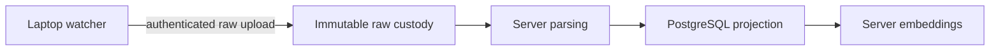

Hosted raw sync is the planned, in-development path for sending original agent
source artifacts to a hosted AgentsView service. The server will keep the
authoritative raw generation, then derive PostgreSQL sessions and embeddings
from it.



This moves long-running parsing and embedding work off laptops and gives the
server enough source material to reparse after parser fixes or rebuild derived
data after loss.

!!! warning "Not available for use yet"

    AgentsView now has a laptop capture-and-upload daemon and the matching raw
    custody transport. It still does not expose device enrollment, server-side
    parsing, or server-owned embeddings. An operator-provisioned device can test raw
    custody, but no supported command enables hosted raw sync end to end.

    The existing [`agentsview pg push`](/docs/pg-sync/) workflow remains supported
    and unchanged. It parses sessions locally and can build embeddings locally
    before pushing derived rows and vectors to PostgreSQL.

The tracked delivery sequence and production acceptance criteria live in
[GitHub issue #1352](https://github.com/kenn-io/agentsview/issues/1352).

## Delivery status

| Layer                  | Status                                                                             | Current boundary                                                                                                    |
| ---------------------- | ---------------------------------------------------------------------------------- | ------------------------------------------------------------------------------------------------------------------- |
| Raw custody            | Foundation implemented in [#1396](https://github.com/kenn-io/agentsview/pull/1396) | Validated objects, canonical manifests, durable receipts, source-head fencing, and parse-job creation               |
| Device authentication  | Foundation implemented in [#1459](https://github.com/kenn-io/agentsview/pull/1459) | Credential exchange, scoped short-lived tokens, server-derived identity, and revocation; no enrollment command yet  |
| HTTP raw transport     | Implemented through resumable object upload                                        | Credential exchange, negotiation, upload, and manifest commit; no remote status endpoint                            |
| Laptop capture         | Implemented for supported local provider sources                                   | Watching, bounded audits, SQLite snapshots, durable spooling, checkpoints, retries, and local status                |
| Server derivation      | Not implemented                                                                    | Manifest materialization, parsing, transactional PostgreSQL projection, and embeddings are not running              |
| Operations and cutover | Not implemented                                                                    | Retention, garbage collection, disaster rebuilds, rollout controls, and migration from `pg push` remain future work |

The broader “device enrollment and authenticated raw transport” delivery item in
#1352 remains incomplete because there is no supported way to enroll a device,
and accepted raw generations are not yet turned into hosted sessions.

## Laptop raw watch daemon

`agentsview raw-sync watch` watches supported local provider roots, captures
their original files, and uploads durable generations. It does not parse
sessions or write the local SQLite archive. S3 roots are excluded.

The server URL and device ID may be flags or environment variables. The device
credential is environment-only so it does not appear in process arguments:

```bash
export AGENTSVIEW_RAW_SYNC_URL=https://agents.example.com
export AGENTSVIEW_RAW_SYNC_DEVICE_ID=device-id
export AGENTSVIEW_RAW_SYNC_CREDENTIAL=device-credential
agentsview raw-sync watch
```

The command performs an initial bounded audit, watches for changes, repeats the
audit every 15 minutes by default, and retries uploads every minute. Captures
and upload state are kept under `raw-sync/` in the configured AgentsView data
directory. `agentsview raw-sync status` prints path-free JSON describing the
local checkpoint, pending work, retry time, failures, and coverage.

The normal writable `agentsview serve` daemon has its own parser watcher. Run
both only when local parsed sessions and hosted raw custody are both required;
doing so intentionally creates two watchers over the same provider roots.

## HTTP control plane

`agentsview pg serve` registers the raw-sync routes when its PostgreSQL role can
write every raw-sync table and the ingest-job sequence. A read-only role keeps
serving the normal PostgreSQL-backed UI and API without these runtime routes.
There is no separate raw-sync configuration switch.

The implemented routes are:

| Route                                   | Authentication                          | Operation                               |
| --------------------------------------- | --------------------------------------- | --------------------------------------- |
| `POST /api/v1/raw-sync/tokens`          | Device credential and device ID         | Issue a 15-minute scoped access token   |
| `POST /api/v1/raw-sync/objects/missing` | Access token with the `negotiate` scope | Return object references not in custody |
| `POST /api/v1/raw-sync/uploads`         | Access token with the `upload` scope    | Start or resume an object upload        |
| `HEAD /api/v1/raw-sync/uploads/{id}`    | Access token with the `upload` scope    | Read the accepted upload offset         |
| `PATCH /api/v1/raw-sync/uploads/{id}`   | Access token with the `upload` scope    | Append and finalize object bytes        |
| `POST /api/v1/raw-sync/manifests`       | Access token with the `commit` scope    | Validate and commit one raw generation  |

These machine routes use their own device credentials and scoped tokens. They do
not accept the shared bearer token that can protect the rest of a remote
AgentsView server. The token endpoint accepts the fixed `negotiate`, `upload`,
`commit`, and `status` scope names. There is not yet a remote status handler;
the current status command reads the laptop checkpoint.

PostgreSQL stores device, token, manifest, receipt, source-head, and parse-job
metadata. The raw object repository is opened lazily under `raw-sync/` in the
configured AgentsView data directory. The HTTP surface is still an internal
protocol for the AgentsView laptop client, not a supported integration API.

## Raw custody contract

The custody foundation accepts a complete logical generation of one provider
source. A generation is represented by a canonical manifest containing:

- the provider, configured source-root identity, and logical source key;
- a capture identity and capture time;
- either a snapshot with ordered file-object references or a tombstone; and
- the expected receipt for the preceding accepted generation.

The custody API accepts authenticated tenant and immutable device identity
separately from the manifest. The HTTP handlers derive that identity through
device authentication instead of accepting tenant or device fields in request
bodies. Canonicalization binds it into the manifest envelope. The canonical JSON
digest becomes the manifest ID.

Raw objects are identified by exact SHA-256 and byte length. Custody is
tenant-scoped, verifies content before registering it, treats an identical retry
as a no-op, and rejects conflicting content. Providers that AgentsView does not
recognize or excludes from remote sync are rejected before their bytes enter
custody.

A manifest can commit only after every referenced object exists and verifies.
The PostgreSQL acceptance transaction then:

1. checks the expected parent receipt against the current source head;
1. records the manifest, file entries, and ordered object references;
1. assigns a monotonically increasing generation and durable receipt;
1. creates the corresponding parse job; and
1. advances the source head.

Repeating the same capture returns its existing receipt. Reusing a capture
identity for different content or committing against a stale parent fails
closed. Accepted manifest metadata is append-only. PostgreSQL holds custody
metadata and processing state; the object store holds the authoritative raw
bytes and canonical manifests.

## Device authentication contract

Enrollment creates an immutable device ID and a random credential. The clear
credential is returned once; PostgreSQL retains only its SHA-256 digest.

An active device exchanges that credential for an opaque, short-lived token.
Tokens can be restricted to one or more fixed operations:

- missing-object negotiation;
- object upload;
- manifest commit; and
- status reads.

Token authentication derives the tenant and device from server-side records and
checks the required scope and expiry. PostgreSQL stores only the token digest.
Revoking a device prevents new token issuance and immediately makes its
outstanding tokens unusable. A human-readable device name is display metadata,
not authorization identity.

## Security and deployment boundary

Raw provider files can contain prompts, responses, tool activity, paths, and
other sensitive data. Hosted raw sync is not end-to-end encrypted: the server
must be able to read retained source files to parse them.

The implemented foundations isolate object and metadata identities by tenant and
do not deduplicate across tenants. A production deployment must also provide TLS
in transit, encryption at rest for object storage, PostgreSQL, backups, and
worker scratch space, plus access controls around device enrollment and
revocation. PostgreSQL row-level security remains a planned defense-in-depth
layer; the current foundation does not configure it.

Do not build integrations against the partial HTTP routes, internal Go packages,
or raw PostgreSQL tables yet. The complete public protocol, operator controls,
compatibility policy, and recovery tooling will be documented when those entry
points exist.
